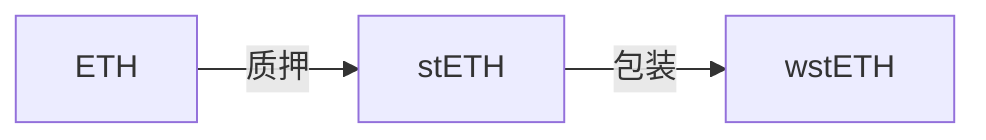

## 初始问题：

1. `ETH`、`stETH`、`wstETH` 的区别
2. 以太坊质押步骤有哪一些
3. lido在质押过程中有哪一些角色，他们又是怎么合作的，对照以太坊步骤给出特点描述？
4. 专业的验证者节点运营商是如何被挑选的，这些挑选是否有社区参与
5. 核心开发团队和Lido的多签治理委员的工作是什么，两者的成员是否高度重合
6. 选择验证者节点运营商未来是否有去中心化考虑

## Question 1

在解析三者区别前，先做简要介绍： `ETH` 全名 `Ether`，是以太坊区块链上的原生代币以及该区块网络的基本交易单位，可用于支付交易费用、和智能合约的执行费用（Gas）；`stETH` 和 `wstETH` 为以太坊上的质押平台 `Lido` 所提供的产品，用于代表质押在以太坊 2.0 上的 `ETH` 及其产生的质押奖励。

通过以上介绍，可以看出 `ETH` 是最基础的代币，`stETH` 和 `wstETH` 则是基于 ETH 的衍生产品。接下来将从以下几个维度比较 `stETH` 和 `wstETH` 之间的区别：

+ 产出区别
+ 数量变化特性
+ 价值变化特性
+ 用途区别

------

### 产出区别

**`stETH`**：为 staked ETH 的简称，用户在 `Lido` 平台上质押 `ETH`，将获得等值的 `stETH` ，代表他们质押的 ETH 及其产生的质押奖励。

**`wstETH`**：为 wrapped stETH 的简称，用户在 `Lido` 平台上包装 `stETH`，获得同等数量的 `wstETH`。

------

### 数量变化特性

**`stETH`**：数量会随着质押奖励的增加而增加，直接反映质押奖励的变化，官方称之为 rebaseable。

**`wstETH`**：数量固定，但其价值会随着 `stETH` 的质押奖励增加而增加，通过价格变化反映质押奖励。

------

### 价值变化特性

**`stETH` 和 `wstETH`**：两者的价值变化特性在本质上是相似的，都是基于质押奖励的增加。随着质押奖励的发放，`stETH` 和 `wstETH` 的总价值都会增加。不过，`stETH` 是通过数量增加反映其价值增长，而 `wstETH` 是通过每单位价值的增加来反映其价值增长。

------

### 用途区别

`wstETH` 由于其数量固定的特性，更易于与其他 `DeFi` 交互。

## Question 2

以太坊质押存在4种类型：

1. Solo home staking（[单独质押](https://ethereum.org/en/staking/solo/#node-and-client-tools)）：官方最为推荐的方式，自己采购硬件设备，并完成软件安装，需 32 颗以太坊开始质押，享受全额收益。
2. Staking as a service（使用[质押即服务提供商](https://ethereum.org/en/staking/saas/#saas-providers)）：
3. Pooled staking（流动池质押）：
4. Centralized exchanges（中心化质押）：

简要描述下单独质押：

Step 1: Prerequisites

Step 2: Configuring Node

Step 3: Installing execution client

Step 4: Installing consensus client

Step 5: Installing Validator

## Questin 3

